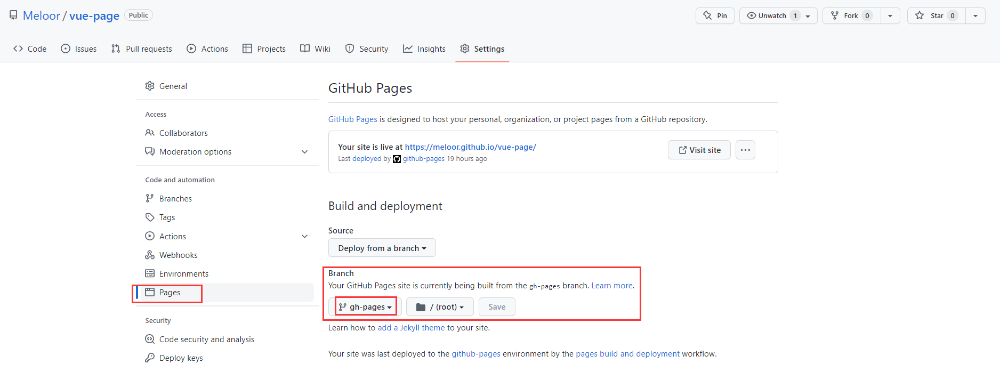

# vue-page
## 1. 介绍
vite开发静态博客。
源码分支：master
静态页面分支：gh-pages

## 2. vite部署github pages步骤
### **0 [本地安装node环境](./node%20install.md)**

wsl2安装nvm:
>curl -o- https://raw.githubusercontent.com/nvm-sh/nvm/v0.39.1/install.sh | bash
source .zshrc # 运行后nvm命令才可以使用

nvm安装node:
>nvm install 18
nvm use 18

yarn安装：
>npm install --global yarn
yarn --version

### **1 本地安装vite环境**
[vite官方文档](https://cn.vitejs.dev/guide/)
> npm create vite@latest
> #or # yarn create vite
### **2 vite配置**
[vite 配置文档](https://cn.vitejs.dev/config/)
1. package.json:
```json
{
    "scripts": {
        "build": "vite build",
        "deploy": "gh-pages -d dist -r https://github.com/Meloor/vue-page.git -b gh-pages"
    }
}
```
### **3 运行部署脚本**
1. npm运行biud脚本进行打包，输出静态页面到dist目录
2. npm运行deploy脚本
```sh
npm run deploy
#or yarn run deploy
```
>js工具包gh-pages会打包(biuld)并且推送dist目录到远程仓库的gh-pages分支


### **4 github action 自动部署**
>github pages设置好部署分支(gh-pages)后，只要接受到了该分支的推送，就会进行**自动部署**(**而gitee pages需要手动点击‘更新’**)，类似于vite的`vite preview`, 等待1-2分钟，进入页面就可以看到更新。
   